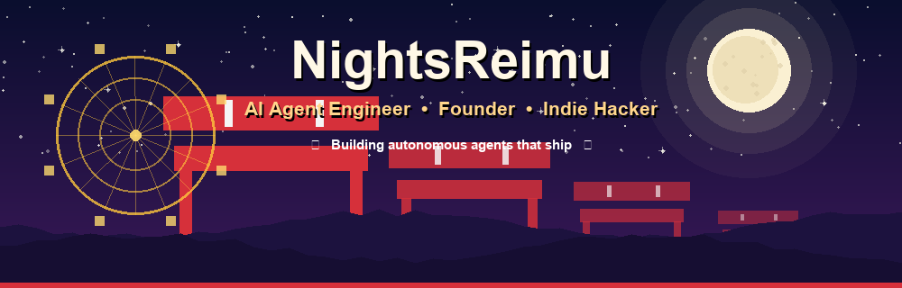

<p align="center">
  
</p>

<p align="center">
  
  
  
  
  
</p>

---

<div align="center">

## ⛩️ AI Engineer · Founder · Indie Hacker
<!-- profile-readme-index -->

> **"Reality is just another boundary — and I blur it for a living."**

I'm **NightsReimu**, an **AI engineer & founder** building autonomous agents and AI systems
that cross the line between *prototype* and *production*.

I've gone from **freelancing** to **founding** — shipping AI products with real users,
real revenue, and production-grade reliability. I keep agents **safe, deterministic
& observable** while they do real work in the human world.

</div>

---

## ⚔️ What I Ship

| Focus | What I Do | Stack |
|---|---|---|
| 🤖 **Agent Orchestration** | Multi-agent systems, autonomous workflows | LangGraph · CrewAI · OpenAI · ReAct |
| 🧠 **RAG & Memory** | Retrieval pipelines, long-term memory | Chroma · FAISS · pgvector · Embeddings |
| ⚙️ **Backend Systems** | High-throughput APIs, tooling | Python · FastAPI · TypeScript · Node.js |
| 🔬 **LLM Engineering** | Fine-tuning, eval, cost optimization | PyTorch · LoRA · vLLM · Evals |
| 🔌 **MCP / Tooling** | Model Context Protocol servers, integrations | MCP Servers · Function Calling |
| ☁️ **Cloud & Infra** | Scalable, observable deployments | Docker · Kubernetes · AWS · CI/CD |
| 🗄️ **Data & Memory** | Durable state, vector storage | PostgreSQL · Redis · Vector DBs |
| 🚢 **Shipping** | From idea to production in weeks | Git · GitHub Actions · Monitoring |

<p align="center">
  
</p>

---

## 🚀 What I'm Building

- 🔮 **Founding** an AI-agent startup — autonomous workers for real-world workflows
- 🤖 Building **MCP servers & agent tooling** that make LLMs actually useful
- 💼 **Freelance** — open to AI agent / LLM integration projects
- 🧪 Experimenting with **multi-agent systems**, memory & long-horizon autonomy

---

## 📊 Track Record

<p align="center">
  
</p>

<p align="center">
  
</p>

---

## 📮 Contact

- 📧 **Email:** nightsreimu@gmail.com
- 🐦 **GitHub:** [@NightsReimu](https://github.com/NightsReimu)

> 合作・创业・AI Agent 项目 → 随时来谈，茶水免费 ☕

---

<div align="center">

```
夜は短し、コードせよ。
The night is short — code on.
```

**Making the impossible boundary a little thinner, one agent at a time. 🌙**

<p>
  
  
</p>

</div>
